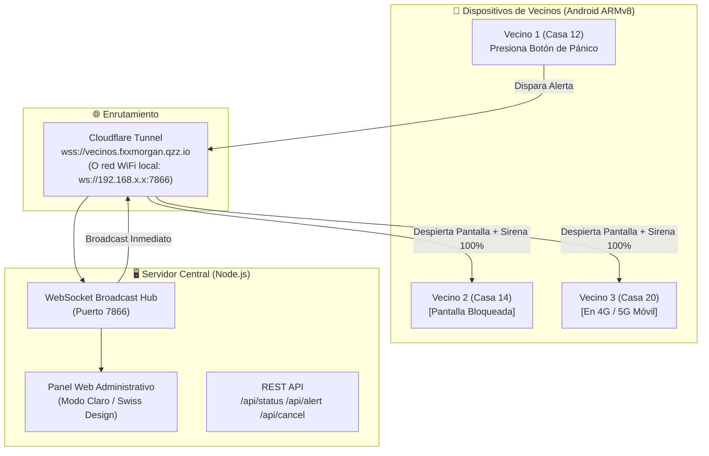

# 🚨 Alerta Vecinal - Sistema de Emergencia Comunitaria

> **MVP Fast** diseñado para comunidades y vecindarios que necesitan una alarma de pánico en tiempo real, de máxima penetración sonora y capaz de **despertar los teléfonos móviles incluso si están con pantalla bloqueada o en modo reposo**, sin depender de servicios de terceros como Firebase.

---

## 🧭 ¿Qué problema resuelve este proyecto?

En vecindarios donde ocurren robos u ocasiones de riesgo, las aplicaciones de mensajería (como WhatsApp) no son suficientes:
- Los mensajes no suenan si el teléfono está en silencio o modo no molestar.
- Los teléfonos entran en reposo profundo (Doze Mode) y demoran las notificaciones.
- No emiten una sirena continua de alta potencia que alerte inmediatamente a todos los hogares vecinos.

**Alerta Vecinal** soluciona esto con una arquitectura directa:
1. Un vecino presiona el botón de pánico en su app.
2. La señal se transmite instantáneamente por **WebSocket**.
3. **Todos los teléfonos suscritos despiertan su pantalla**, ajustan su volumen al 100% y reproducen una sirena de emergencia penetrante en bucle continuo acompañada de vibración agresiva.

---

## 🏗️ Arquitectura del Sistema



---

## 📁 Estructura del Repositorio

```text
alerta-vecinal/
├── app/                  # Aplicación móvil en Flutter
│   ├── android/          # Configuración nativa Android (Permisos, Kotlin, Foreground Service)
│   ├── assets/sounds/    # Audio de la sirena de alarma continua (alarm_siren.wav)
│   ├── lib/              # Código Dart (Servicios, Pantallas, Modelo y Tema)
│   │   ├── main.dart
│   │   ├── models/       # AlertModel
│   │   ├── screens/      # HomeScreen, ActiveAlertView, SettingsSheet
│   │   ├── services/     # AlarmPlayerService, AlarmSyncService, NativeAlertService
│   │   └── theme/        # AppTheme (Modo Claro estricto, paleta armónica)
│   └── pubspec.yaml
├── releases/             # APK compilado listo para instalar
│   └── AlertaVecinal-ARMv8.apk
├── server/               # Servidor local Node.js
│   ├── package.json
│   └── server.js         # Servidor HTTP + WebSocket + Dashboard Web integrado
└── README.md
```

---

## 🚀 Inicio Rápido (Quickstart)

### Opción 1: Instalar directamente el APK en tu teléfono

No necesitas compilar si solo quieres probar:
1. Copia el archivo **`releases/AlertaVecinal-ARMv8.apk`** a tu teléfono Android.
2. Ábrelo e instala la aplicación (autoriza la instalación de aplicaciones de origen desconocido).
3. **MUY IMPORTANTE**: Al abrir la app verás un banner amarillo que dice:
   > **Optimización de Batería Activa**
   > *Pulsa en "Excluir de Optimización" y selecciona Permitir*.
   > 
   > 👉 **¿Por qué es obligatorio?** Android apaga las antenas de red y suspende procesos cuando la pantalla se bloquea. Al excluirla, el socket permanece despierto 24/7 sin consumir batería innecesaria.
4. Por defecto, la app ya viene conectada al servidor a través del túnel:
   `wss://vecinos.fxxmorgan.qzz.io`. Si tienes tu propio servidor, puedes cambiar la IP en el ícono de engranaje (⚙️).

---

### Opción 2: Correr tu propio Servidor Local

1. Entra a la carpeta del servidor:
   ```bash
   cd server
   ```
2. Instala las dependencias (solo usa `ws`):
   ```bash
   npm install
   ```
3. Inicia el servidor:
   ```bash
   node server.js
   ```
   Verás una salida similar a:
   ```text
   ======================================================
   🚨 SERVIDOR DE ALERTA VECINAL INICIADO CON ÉXITO
   ======================================================
   📍 IP Local detectada:   192.168.18.100
   🌐 Panel Web / REST:     http://192.168.18.100:7866
   ⚡ WebSocket URL:         ws://192.168.18.100:7866
   💻 Localhost:            http://localhost:7866
   ======================================================
   ```
4. Abre `http://localhost:7866` en tu navegador para ver el **Panel de Administración en Vivo**:
   - Lista en tiempo real de todos los vecinos conectados con su nombre y hora de conexión.
   - Botón para emitir una alerta de prueba comunitaria.
   - Botón para silenciar y cancelar la alerta general.

---

## 🛠️ ¿Cómo conectar el Servidor con Cloudflare Tunnel?

Para que los vecinos reciban alertas desde cualquier lugar (estando en la calle con datos móviles 4G/5G o en casas lejanas sin compartir WiFi):

1. Instala `cloudflared` o usa el panel web de **Cloudflare Zero Trust**.
2. Agrega una ruta pública (Public Hostname):
   - **Subdominio**: `vecinos.tudominio.com`
   - **Service Type**: `HTTP`
   - **URL**: `localhost:7866`
3. ¡Listo! Cloudflare se encarga del certificado SSL y WebSocket seguro (`wss://`).

---

## 🔬 ¿Cómo funciona técnicamente la Alerta Máxima?

El mayor desafío en Android moderno es lograr que una alerta suene a todo volumen con la pantalla apagada. Así está resuelto en este proyecto:

1. **Permiso de Ignorar Optimización de Batería (`REQUEST_IGNORE_BATTERY_OPTIMIZATIONS`)**:
   - Previene que el recolector de tareas y Doze Mode suspendan el hilo de red.
2. **Servicio en Primer Plano (`flutter_foreground_task`)**:
   - Corre con permisos `FOREGROUND_SERVICE_REMOTE_MESSAGING` y `FOREGROUND_SERVICE_DATA_SYNC` (compatibles con Android 14+).
   - Mantiene activos `WakeLock` y `WifiLock`.
3. **Despertar Pantalla Bloqueada (Canal Nativo Kotlin)**:
   - En `android/app/src/main/kotlin/.../MainActivity.kt`:
     ```kotlin
     setShowWhenLocked(true)
     setTurnScreenOn(true)
     powerManager.newWakeLock(
         PowerManager.FULL_WAKE_LOCK or PowerManager.ACQUIRE_CAUSES_WAKEUP,
         "AlertaVecinal:EmergencyWakeLock"
     ).acquire(15000L)
     keyguardManager.requestDismissKeyguard(this, null)
     ```
4. **Volumen de Alarma Forzado**:
   - Utiliza `AudioManager.STREAM_ALARM` y `AudioManager.STREAM_MUSIC` ajustados programáticamente a su valor máximo (`getStreamMaxVolume`) en el instante exacto en que llega la señal.
5. **Generador de Sirena WAV Penetrate**:
   - Sirena sintetizada de frecuencia oscilante entre 650 Hz y 1350 Hz con sobretonos armónicos para penetrar paredes y ambientes de sueño profundo.

---

## 💻 Compilar la App Flutter desde Código

Si deseas hacer modificaciones o generar un nuevo APK:

```bash
cd app

# Instalar dependencias
flutter pub get

# Verificar que no hayan errores de análisis
dart analyze lib

# Compilar APK optimizado para arquitectura ARMv8 (64-bit)
flutter build apk --target-platform android-arm64
```
El archivo resultante se generará en:
`app/build/app/outputs/flutter-apk/app-release.apk`

---

## 🎨 Diseño Visual e Identidad

La aplicación y el panel web siguen estrictamente los principios de **Modo Claro Primero (Enterprise Clean / Swiss Design)**:
- **Fondos y Superficies**: Blanco puro (`#FFFFFF`) y porcelana (`#F8FAFC`).
- **Bordes**: Pizarra fina (`#E2E8F0`).
- **Tipografía**: Pizarra profunda (`#0F172A` / `#1E293B`).
- **Estados**:
  - 🟢 **Verde Salvia (`#68A678`)**: En línea y red protegida.
  - 🟡 **Ámbar (`#E09F67`)**: Reconectando o advertencias de configuración.
  - 🔴 **Coral / Carmesí (`#DC2626`)**: Alerta de pánico en curso.

---

## 📄 Licencia

Proyecto de código abierto desarrollado para seguridad comunitaria y vecinal. Libre para uso, modificación y despliegue libre.
